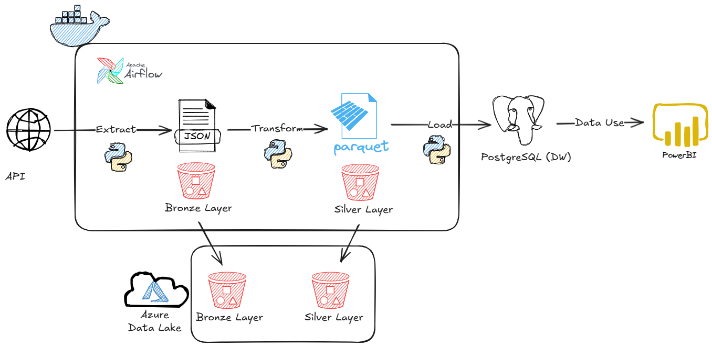

# Weather Pipeline ETL

Este é um projeto de **Engenharia de Dados** desenvolvido como portfólio para simular um cenário real corporativo. Ele demonstra na prática todo o fluxo necessário para extrair, limpar e persistir dados climáticos de forma 100% automática, usando arquitetura ETL e estruturação em camadas Medallion.

## 1. Objetivo
Estruturar o fluxo automatizado de extração diária de dados climáticos consumidos da OpenWeatherMap API, promovendo a limpeza e padronização (Camadas Bronze e Silver) e finalizando com a carga persistente em um banco de dados PostgreSQL (Camada Gold). Os dados ingeridos no banco podem ser usados para criar visualizações e dashboards no Power BI ou outras ferramentas.

## 2. Tecnologias
- **[Python](https://docs.python.org/3/)**: Linguagem principal para desenvolvimento dos scripts de integração e processamento.
- **[Docker](https://docs.docker.com/)**: Infraestrutura de conteinerização encarregada pelo isolamento e provisionamento do cluster (orquestrador e banco).
- **[Apache Airflow](https://airflow.apache.org/docs/)**: Orquestração, monitoramento e agendamento de tarefas via TaskFlow API. Executado via Docker Compose.
- **[Azure Data Lake](https://learn.microsoft.com/azure/storage/blobs/data-lake-storage-introduction)**: Plataforma de armazenamento em nuvem usada para guardar os dados brutos da camada Bronze de forma segura.
- **[Pandas](https://pandas.pydata.org/docs/)**: Transformação de dados brutos e conversão direta para o formato otimizado em `.parquet`.
- **[PostgreSQL](https://www.postgresql.org/docs/)**: Servidor de banco de dados relacional atuando como Data Warehouse local.
- **[SQLAlchemy](https://docs.sqlalchemy.org/)**: Comunicação ORM para inserção de DataFrames de forma automatizada no PostgreSQL.
- **[Loguru](https://loguru.readthedocs.io/)**: Padronização e estruturação dos logs de execução das rotinas.
- **[Pytest & Pytest-Cov](https://docs.pytest.org/)**: Framework para criar testes automatizados e medir o quanto o código está coberto (Code Coverage), usando Mocks para simular dependências externas.
- **[Power BI](https://learn.microsoft.com/power-bi/)**: Ferramenta de visualização final de BI alimentada pela base relacional tratada no PostgresSQL (camada Gold).

## 3. Estrutura do Projeto

O diagrama abaixo ilustra o fluxo de dados na arquitetura em camadas (Medallion Architecture). O processo inicia com a extração de arquivos da API e salvos na **Camada Bronze (Azure Data Lake e Local)** sob o formato JSON inalterado. Em seguida, os dados passam por processo de transformação, realizando limpeza e padronização, e salvos na **Camada Silver (Também no Azure Data Lake e Local)** sob o formato Parquet. A etapa final persiste os dados modelados na **Camada Gold**, utilizando o **PostgreQL** como um Data Warehouse local, disponibilizando assim a base consolidada para consumo estruturado nos **painéis do Power BI**.



- Organização física dos diretórios e arquivos do projeto:
```text
weather_pipeline_etl/
├── dags/
│   └── weather_etl_dag.py        # DAG orquestradora usada pelo Airflow
├── data/
│   ├── bronze/                   # Camada Bronze: Arquivos brutos JSON da API
│   └── silver/                   # Camada Silver: Dados limpos em formato Parquet
├── src/
│   ├── jobs/                     # Scripts isolados de E-T-L (extract.py, transform.py, load.py)
│   └── modules/                  # Conectores, adaptadores, serviços e utilitários (API, BD)
├── tests/                        # Testes unitários das funções de E-T-L
├── docker-compose.yml            # Arquivo de infraestrutura de containers do Airflow
└── main.py                       # Orquestração manual do pipeline completo via terminal
```

## 4. Configuração e Dependências

### 4.1 Variáveis de Ambiente (.env)
Crie um arquivo `.env` na raiz do projeto com as credenciais obrigatórias para inicializar os ambientes:
```env
WEATHER_API_KEY=sua_chave_openweather
AIRFLOW_UID=501
PG_USER=seu_usuario_postgres
PG_PASSWORD=sua_senha_postgres
PG_HOST=host.docker.internal
PG_PORT=5432
PG_DB=seu_banco_de_dados

# Força a instalação nativa destas bibliotecas durante a criação do container Airflow
_PIP_ADDITIONAL_REQUIREMENTS="loguru pyarrow pandas psycopg2-binary"
```

### 4.2 Mapeamento de Rede Host para WSL/Docker
Como a infraestrutura do Airflow opera em containers, é necessário configurar o PostgreSQL instalado na máquina local do host Windows a autorizar requisições das sub-redes Docker e WSL (se usado):

1. Modifique o arquivo `pg_hba.conf` do PostgreSQL Server inserindo os direcionamentos IP:
```conf
# Acesso interno para serviços Docker
host    all    all    172.18.0.0/16     md5
# Acesso interno para o terminal WSL
host    all    all    192.168.0.0/24    md5
```
2. Crie uma regra explícita no **Firewall do Windows** permitindo tráfego de entrada na porta de conexão de entrada TCP do PostgreSQL (`5432`).

### 4.3 Criação do Banco e Permissões de Esquema
Como a aplicação opera sob o princípio de mínimo privilégio, é necessário criar previamente o usuário de conexão configurado no `.env` e seu respectivo escopo.

Acesse o PostgreSQL do host Windows como superusuário (geralmente `postgres`) e execute sequencialmente:
```sql
-- Crie o usuário no Postgres apenas se necessário
CREATE USER seu_usuario_postgres WITH PASSWORD 'sua_senha_postgres';

-- Crie o banco de dados apenas se necessário
CREATE DATABASE seu_banco_de_dados OWNER seu_usuario_postgres;

-- Após conectar-se ao banco (seu_banco_de_dados), libere os privilégios gerais:
GRANT ALL ON SCHEMA public TO seu_usuario_postgres;
```

## 5. Testes Unitários e Qualidade de Código
Para garantir que o pipeline funcione de forma confiável e funcione com resiliência, foram desenvolvidos testes automatizados em todo o código.

- **Uso de Mocks (Simulações):** Durante os testes, não conectamos de verdade no banco de dados nem baixamos arquivos reais da API. O Pytest usa "Mocks" para simular essas conexões. Isso faz os testes rodarem rápido e de forma segura, sem poluir o banco original.
- **Prevenção de Falhas:** Os testes validam situações críticas, como: o que fazer se o banco estiver vazio (Dia Zero)? E se a tabela não existir? E se não houver dados novos para baixar? Todos esses cenários foram tratados e validados nos testes, garantindo a integridade do pipeline.

Para executar os testes e ver a taxa de cobertura do código (Coverage):
```bash
python -m pytest tests/ -v --cov
coverage html
```
O relatório pode ser visualizado acessando `htmlcov/index.html` em seu navegador, comprovando a eficácia da cobertura de código (`> 85%`).

## 6. Como Executar e Validar

1. Com o Docker aberto na sua máquina, inicie o cluster do Airflow rodando no terminal:
```bash
docker compose up -d
```
2. Assim que subir, acesse a interface visual do orquestrador pelo seu navegador no endereço `http://localhost:8080`.
3. Ligue a chave da DAG `weather_pipeline_etl`. O Airflow irá iniciar a execução do ETL.
4. Abra o arquivo do **Power BI** (`.pbix`) já fornecido neste projeto. Como os painéis já foram desenvolvidos e modelados, apenas valide as credenciais solicitadas do banco na porta `5432` para atualizar e interagir instantaneamente com os dados extraídos da Camada Gold!

## 7. Melhorias Futuras (Next Steps)
Para evoluir a arquitetura e escalabilidade do projeto em um cenário de produção avançado, algumas melhorias contínuas podem ser implementadas:

- **Integração e Entrega Contínua (CI/CD):** Implementação de pipelines automatizados (ex: GitHub Actions) para rodar a suíte do Pytest a cada push e fazer o deploy automático.
- **Uso de Spark:** Substituir o uso do Pandas por Spark para processamento e transformação de dados, permitindo escalabilidade com processamento em paralelo.